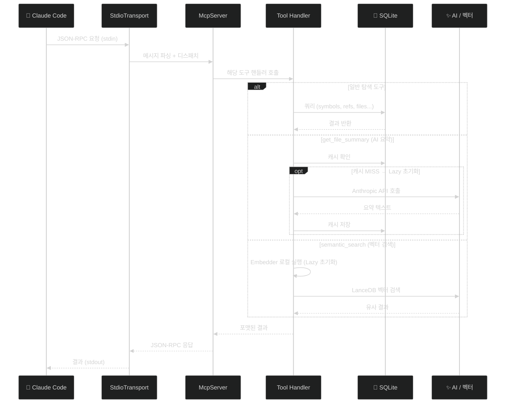
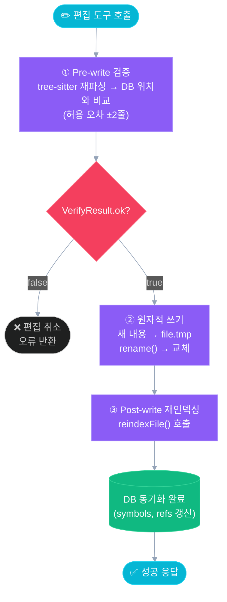
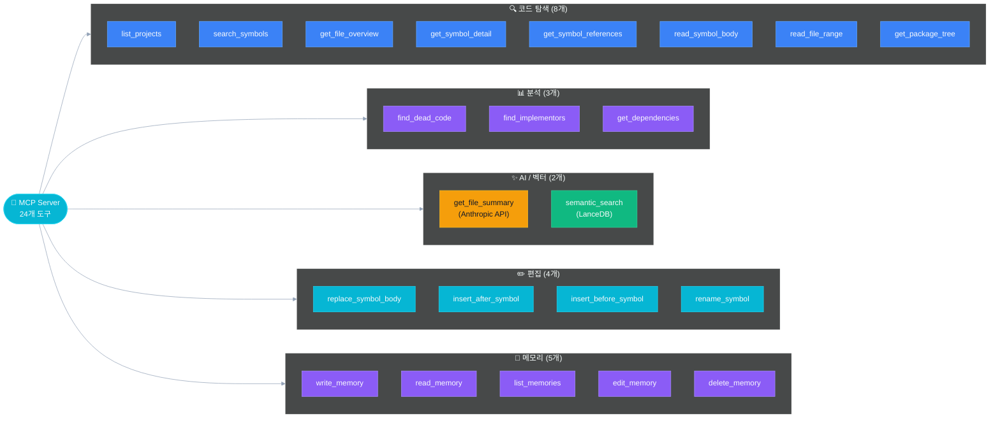

# MCP 서버 & 도구

CodeAtlas는 [Model Context Protocol(MCP)](https://modelcontextprotocol.io) 표준을 구현한 stdio 서버로 동작합니다.  
Claude 같은 MCP 클라이언트에 **24개 코드 탐색·편집·메모리 도구**를 제공합니다.

**관련 파일**:
- `src/mcp/server.ts` — 서버 진입점, 도구 등록
- `src/mcp/write-tools.ts` — 편집 도구 구현
- `src/mcp/dead-code-formatter.ts` — 데드 코드 결과 포맷터
- `src/mcp/memory-tools.ts` — 메모리 도구 어댑터

---

## 서버 구조

```typescript
// startMcpServer()의 주요 흐름
const db = openDatabase(dbPath);

const server = new McpServer({
  name: 'codeatlas',
  version: '0.1.0',
});

// Lazy 초기화 (첫 호출 시 활성화)
let summarizer: Summarizer | null = null;    // AI 요약
let vectorStore: VectorStore | null = null;   // 시맨틱 검색
let embedder: Embedder | null = null;

// 도구 24개 등록
server.tool('list_projects', ...);
server.tool('search_symbols', ...);
// ...

await server.connect(new StdioServerTransport());
```

MCP 서버의 요청 수명주기를 시퀀스로 표현하면 다음과 같습니다:



---

## 탐색 도구 (13개)

### `list_projects`

인덱싱된 모든 프로젝트 목록과 통계를 반환합니다.

**파라미터**: 없음

**응답 예시**:
```
Projects (2):
1. my-app
   Path: /projects/my-app
   Files: 87, Symbols: 1203
   Last indexed: 2026-04-14T00:00:00.000Z
```

---

### `search_symbols`

심볼 이름으로 FTS 검색합니다. FTS5 prefix 매칭 → LIKE fallback 순으로 동작합니다.

| 파라미터 | 타입 | 필수 | 설명 |
|---------|------|------|------|
| `query` | string | ✓ | 검색어 |
| `kind` | enum | | `class`, `interface`, `enum`, `method`, `field`, `constructor` |
| `project` | string | | 특정 프로젝트 이름으로 필터 |
| `limit` | number | | 최대 결과 수 (기본: 30) |

---

### `get_file_overview`

파일 내 심볼 계층 트리를 반환합니다.

| 파라미터 | 타입 | 필수 | 설명 |
|---------|------|------|------|
| `file_path` | string | ✓ | 절대 경로 또는 프로젝트 내 상대 경로 |

**응답 예시**:
```
UserService.java
  [class] UserService
    [method] public User findById(Long id) :12
    [method] public List<User> findAll() :25
    [field] private final UserRepository userRepository :8
```

---

### `get_symbol_detail`

특정 심볼의 상세 정보(시그니처, 수식어, 어노테이션, 계층 위치, 참조 통계)를 반환합니다.

| 파라미터 | 타입 | 필수 | 설명 |
|---------|------|------|------|
| `file_path` | string | ✓ | 파일 경로 |
| `symbol_name` | string | ✓ | 심볼 이름 |

---

### `get_dependencies`

파일의 import, extends, implements 의존성 목록을 반환합니다.

| 파라미터 | 타입 | 필수 | 설명 |
|---------|------|------|------|
| `file_path` | string | ✓ | 파일 경로 |

---

### `find_implementors`

인터페이스를 구현한 클래스 목록을 반환합니다.

| 파라미터 | 타입 | 필수 | 설명 |
|---------|------|------|------|
| `interface_name` | string | ✓ | 인터페이스 이름 |
| `project` | string | | 특정 프로젝트로 제한 |

---

### `get_package_tree`

패키지 계층 구조 트리를 반환합니다.

| 파라미터 | 타입 | 필수 | 설명 |
|---------|------|------|------|
| `project` | string | | 특정 프로젝트 (미지정 시 전체) |
| `depth` | number | | 트리 깊이 (기본: 4) |

**응답 예시**:
```
com
  example
    domain
      user (3 files)
      order (5 files)
    infrastructure
      persistence (4 files)
```

---

### `get_symbol_references`

심볼이 호출되는 모든 위치를 반환합니다.

| 파라미터 | 타입 | 필수 | 설명 |
|---------|------|------|------|
| `symbol_name` | string | ✓ | 심볼 이름 |
| `project` | string | | 특정 프로젝트로 제한 |

---

### `read_symbol_body`

심볼의 소스 코드를 파일에서 직접 읽어 반환합니다.

| 파라미터 | 타입 | 필수 | 설명 |
|---------|------|------|------|
| `file_path` | string | ✓ | 파일 경로 |
| `symbol_name` | string | ✓ | 심볼 이름 |

---

### `read_file_range`

파일의 특정 라인 범위를 읽어 반환합니다.

| 파라미터 | 타입 | 필수 | 설명 |
|---------|------|------|------|
| `file_path` | string | ✓ | 파일 경로 |
| `start_line` | number | ✓ | 시작 라인 (1-based) |
| `end_line` | number | ✓ | 끝 라인 (1-based) |

---

### `find_dead_code`

참조가 없는 잠재적 데드 심볼을 탐색합니다.  
프로젝트별 `.codeatlas.yaml`의 `dead_code` 설정을 자동으로 로드합니다.

| 파라미터 | 타입 | 필수 | 설명 |
|---------|------|------|------|
| `project` | string | | 특정 프로젝트로 제한 (미지정 시 전체) |
| `kind` | enum | | `class`, `interface`, `enum`, `method`, `field` |

**자동 제외 대상**:
- Spring 어노테이션 (`@Service`, `@RestController` 등 12개)
- `main()` 메서드, `public static final` 상수
- 생성자, 열거형, 어노테이션 타입

---

### `get_file_summary`

Anthropic API를 통해 파일 요약을 생성하고 DB에 캐시합니다.

| 파라미터 | 타입 | 필수 | 설명 |
|---------|------|------|------|
| `file_path` | string | ✓ | 파일 경로 |

**동작 방식**:
1. DB에 캐시된 요약 확인
2. 캐시 있고 모델 버전 일치 → 즉시 반환
3. 캐시 없거나 모델 버전 불일치 → Anthropic API 호출 후 캐시 저장

> `ANTHROPIC_API_KEY` 환경 변수 필요

---

### `semantic_search`

자연어 쿼리를 벡터 임베딩으로 변환하여 의미 기반 검색을 수행합니다.

| 파라미터 | 타입 | 필수 | 설명 |
|---------|------|------|------|
| `query` | string | ✓ | 자연어 검색어 |
| `project` | string | | 특정 프로젝트로 제한 |
| `kind` | `'file'` \| `'symbol'` | | 검색 대상 제한 |
| `limit` | number | | 최대 결과 수 (기본: 10) |

> `codeatlas embed <project>` 선행 실행 필요

---

## 편집 도구 (4개)

모든 편집 도구는 **3단계 안전 프로토콜**을 적용합니다:



---

### `replace_symbol_body`

심볼 전체(선언 포함)를 새 내용으로 교체합니다.

| 파라미터 | 타입 | 필수 | 설명 |
|---------|------|------|------|
| `file_path` | string | ✓ | 파일 경로 |
| `symbol_name` | string | ✓ | 교체할 심볼 이름 |
| `new_content` | string | ✓ | 새 소스 코드 (선언 포함 전체) |

---

### `insert_after_symbol`

심볼 끝(닫는 괄호 다음 줄)에 코드를 삽입합니다.

| 파라미터 | 타입 | 필수 | 설명 |
|---------|------|------|------|
| `file_path` | string | ✓ | 파일 경로 |
| `symbol_name` | string | ✓ | 기준 심볼 이름 |
| `content` | string | ✓ | 삽입할 코드 |

---

### `insert_before_symbol`

심볼 시작(선언 줄 이전)에 코드를 삽입합니다.

| 파라미터 | 타입 | 필수 | 설명 |
|---------|------|------|------|
| `file_path` | string | ✓ | 파일 경로 |
| `symbol_name` | string | ✓ | 기준 심볼 이름 |
| `content` | string | ✓ | 삽입할 코드 |

---

### `rename_symbol`

프로젝트 내 모든 파일에서 심볼 이름을 텍스트 기반으로 변경합니다.

| 파라미터 | 타입 | 필수 | 설명 |
|---------|------|------|------|
| `file_path` | string | ✓ | 심볼이 선언된 파일 경로 |
| `symbol_name` | string | ✓ | 현재 이름 |
| `new_name` | string | ✓ | 변경할 이름 |

> **주의**: 텍스트 검색·교체 방식입니다.  
> 리플렉션(`Class.forName()`)이나 문자열 참조는 탐지되지 않습니다.

---

## 편집 도구 안전성 상세

### `verifySymbolPosition`

```typescript
interface VerifyResult {
  ok: boolean;
  startLine?: number;
  endLine?: number;
  message?: string;
}
```

tree-sitter로 현재 파일을 파싱하여 DB에 저장된 `start_line`/`end_line`과 비교합니다.  
허용 오차 ±2줄 이내면 OK (공백 변경 허용).

### `atomicWriteFile`

```typescript
// .tmp 파일에 쓰고 rename()
const tmpPath = filePath + '.tmp';
writeFileSync(tmpPath, newContent, 'utf8');
renameSync(tmpPath, filePath);
```

---

## Lazy 초기화

AI 요약과 시맨틱 검색 기능은 필요 시에만 초기화됩니다:

```typescript
// get_file_summary 첫 호출 시
if (!summarizer) {
  const anthropic = new Anthropic();
  summarizer = new Summarizer(anthropic, { model: DEFAULT_MODEL });
}

// semantic_search 첫 호출 시
if (!vectorStore) {
  embedder = new Embedder();
  vectorStore = await VectorStore.open(vectorsPath);
}
```

이를 통해 API 키나 벡터 DB 없이도 탐색 도구를 사용할 수 있습니다.

---

## 도구 분류 개요

24개 도구를 역할별로 분류하면 다음과 같습니다:



---

## 도구 요약 테이블

| # | 도구 | 종류 | AI/벡터 필요 |
|---|------|------|:---:|
| 1 | `list_projects` | 탐색 | |
| 2 | `search_symbols` | 탐색 | |
| 3 | `get_file_overview` | 탐색 | |
| 4 | `get_symbol_detail` | 탐색 | |
| 5 | `get_dependencies` | 탐색 | |
| 6 | `find_implementors` | 탐색 | |
| 7 | `get_package_tree` | 탐색 | |
| 8 | `get_symbol_references` | 탐색 | |
| 9 | `read_symbol_body` | 탐색 | |
| 10 | `read_file_range` | 탐색 | |
| 11 | `find_dead_code` | 탐색 | |
| 12 | `get_file_summary` | 탐색 | AI ✓ |
| 13 | `semantic_search` | 탐색 | 벡터 ✓ |
| 14 | `replace_symbol_body` | 편집 | |
| 15 | `insert_after_symbol` | 편집 | |
| 16 | `insert_before_symbol` | 편집 | |
| 17 | `rename_symbol` | 편집 | |
| 18 | `get_impact_analysis` | 분석 | |
| 19 | `find_circular_deps` | 분석 | |
| 20 | `write_memory` | 메모리 | |
| 21 | `read_memory` | 메모리 | |
| 22 | `list_memories` | 메모리 | |
| 23 | `edit_memory` | 메모리 | |
| 24 | `delete_memory` | 메모리 | |
