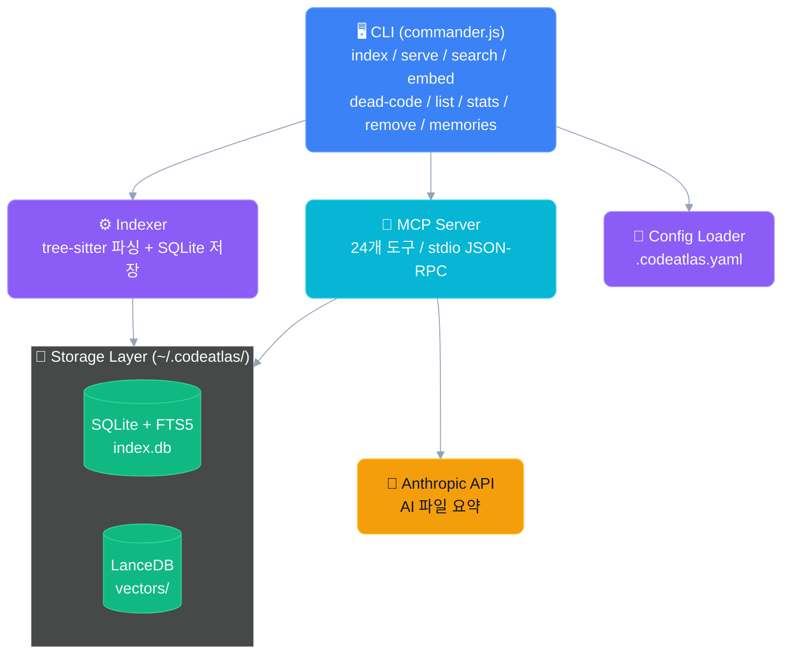
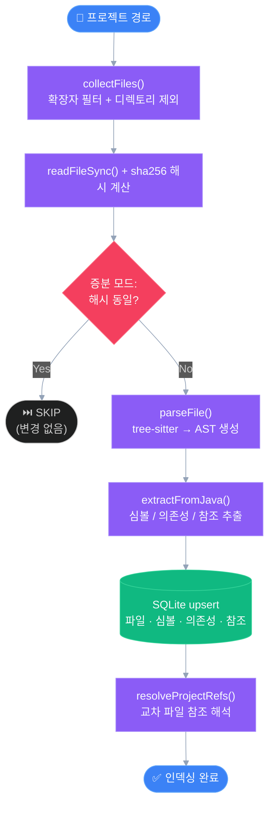

# CodeAtlas 아키텍처 개요

## 프로젝트 목적

CodeAtlas는 Java · JavaScript · TypeScript · Vue 프로젝트를 **영속적 코드 인덱스**로 변환하고, 이를 MCP(Model Context Protocol) 서버로 노출하여 Claude 같은 AI 에이전트가 IDE 수준의 코드 탐색 능력을 갖추도록 합니다.

**핵심 문제**: Claude Code 대화 시 매번 코드베이스를 처음부터 재분석하는 비효율  
**해결책**: 사전 파싱 결과를 SQLite에 영속 저장 → 대화 시작 즉시 쿼리

---

## 전체 구조



---

## 운영 모드

CodeAtlas는 두 가지 모드로 동작합니다:

### CLI 모드

직접 명령줄에서 사용. 인덱싱, 검색, 데드코드 탐지, 임베딩 생성에 사용.

```bash
codeatlas index /path/to/project
codeatlas search UserService
codeatlas dead-code my-app
```

### MCP 서버 모드

Claude Code(또는 다른 MCP 클라이언트)에 stdio JSON-RPC 서버로 동작.  
Claude가 코드 탐색 · 편집 · AI 요약 · 시맨틱 검색을 도구로 호출.

```bash
codeatlas serve
```

---

## 계층 구조

```
src/
  cli/          ← 진입점, commander.js 명령 정의
  config/       ← .codeatlas.yaml 로더 + 타입 정의
  indexer/      ← 파싱 엔진 (tree-sitter) + 인덱싱 오케스트레이터
  storage/      ← SQLite DDL, 쿼리 함수 (CRUD + FTS)
  mcp/          ← MCP 서버, 도구 등록, 편집 도구, 메모리 도구
  memory/       ← 프로젝트 지식 저장소 (.codeatlas/memories/ CRUD + AI 온보딩)
  summarizer/   ← Anthropic API 요약 생성 + DB 캐시
  vectors/      ← 임베딩 (Xenova), LanceDB, 시맨틱 검색
  graph/        ← Kuzu 그래프 DB, 영향 분석, 순환 의존성 탐지
```

---

## 데이터 흐름

### 인덱싱 파이프라인



### MCP 도구 호출 흐름

```mermaid
%%{init: {'theme': 'dark', 'themeVariables': {'primaryColor': '#3b82f6', 'primaryTextColor': '#f8fafc', 'primaryBorderColor': '#60a5fa', 'lineColor': '#94a3b8', 'secondaryColor': '#1e293b', 'tertiaryColor': '#0f172a'}}}%%
sequenceDiagram
    participant C as 🤖 Claude
    participant M as 🔌 MCP Server
    participant DB as 💾 SQLite
    participant AI as ✨ Anthropic API
    participant V as 🔍 LanceDB

    Note over C,M: stdio JSON-RPC

    rect rgb(30, 41, 59)
        Note over C,DB: 탐색 도구 (search_symbols 등)
        C->>M: 도구 호출
        M->>DB: 쿼리 실행
        DB-->>M: 결과
        M-->>C: 포맷된 응답
    end

    rect rgb(30, 41, 59)
        Note over C,AI: AI 요약 (get_file_summary)
        C->>M: get_file_summary
        M->>DB: 캐시 확인
        alt 캐시 HIT
            DB-->>M: 저장된 요약
        else 캐시 MISS
            M->>AI: API 호출
            AI-->>M: 요약 텍스트
            M->>DB: 캐시 저장
        end
        M-->>C: 요약 응답
    end

    rect rgb(30, 41, 59)
        Note over C,V: 시맨틱 검색 (semantic_search)
        C->>M: semantic_search
        M->>M: 로컬 Embedder 실행
        M->>V: 벡터 유사도 검색
        V-->>M: 결과 (score + metadata)
        M-->>C: 포맷된 응답
    end

    rect rgb(30, 41, 59)
        Note over C,DB: 편집 도구 (replace_symbol_body 등)
        C->>M: 편집 도구 호출
        M->>DB: 심볼 위치 검증
        M->>M: 원자적 파일 쓰기 (.tmp → rename)
        M->>DB: reindexFile (DB 동기화)
        M-->>C: 완료 응답
    end
```



---

## 핵심 기술 스택

| 영역 | 기술 | 역할 |
|------|------|------|
| 파싱 | tree-sitter + tree-sitter-java / javascript / typescript | Java · JS · TS · Vue SFC AST 생성 |
| 저장 | SQLite + better-sqlite3 + FTS5 | 심볼 영속화 + 키워드 검색 |
| 벡터 DB | LanceDB | 시맨틱 검색 벡터 저장 |
| 임베딩 | @xenova/transformers (all-MiniLM-L6-v2) | 로컬 텍스트 임베딩 (384차원) |
| MCP | @modelcontextprotocol/sdk | AI 클라이언트 통합 |
| AI 요약 | @anthropic-ai/sdk | 파일 요약 생성 |
| CLI | commander.js | 명령줄 인터페이스 |
| 설정 | yaml | .codeatlas.yaml 파싱 |
| 패턴 매칭 | picomatch | 데드코드 파일 제외 glob |

---

## 주요 설계 결정

### SQLite 선택 이유

- 36K 파일 규모에서 JSON 선형 스캔 불가
- FTS5 전문 검색으로 심볼명 검색 밀리초 처리
- 단일 파일(`~/.codeatlas/index.db`)로 관리 단순화
- `better-sqlite3`의 동기 API로 MCP 서버 구현 단순화

### Lazy AI 요약

첫 `get_file_summary` 호출 시 생성하고 DB에 캐시합니다.  
36K 파일 일괄 요약 시 과도한 API 비용을 방지합니다.

### 로컬 임베딩

`@xenova/transformers` 로 Anthropic API 없이 로컬 임베딩 생성.  
초기 23MB 모델 다운로드 이후 완전 오프라인 동작.

### 편집 도구 3단계 안전 프로토콜

1. Pre-write 검증 (tree-sitter 재파싱으로 심볼 위치 확인)
2. 원자적 쓰기 (`.tmp` → `rename()`)
3. Post-write 재인덱싱 (DB 자동 동기화)

---

## 연관 문서

- [저장소 계층 (Storage)](./storage.md)
- [인덱싱 엔진 (Indexer)](./indexer.md)
- [MCP 서버 & 도구](./mcp-server.md)
- [설정 파일](./configuration.md)
