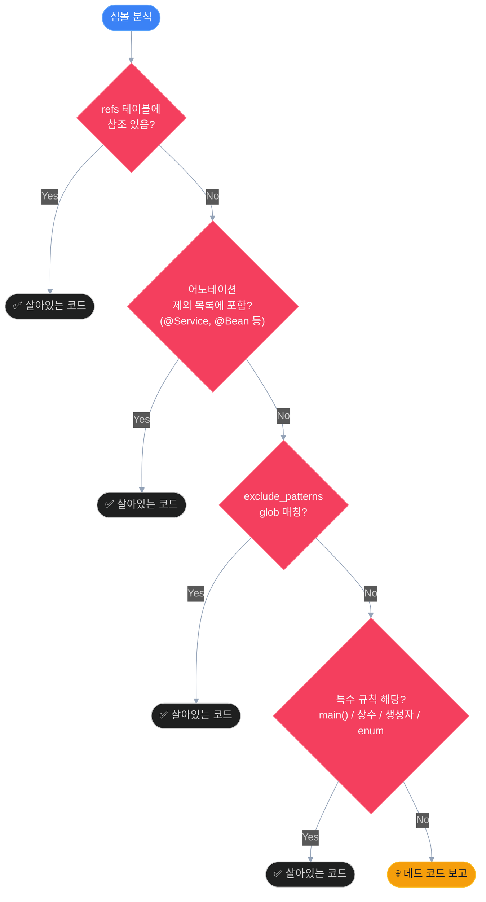
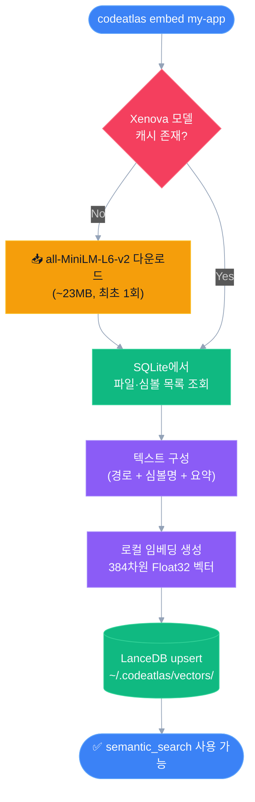
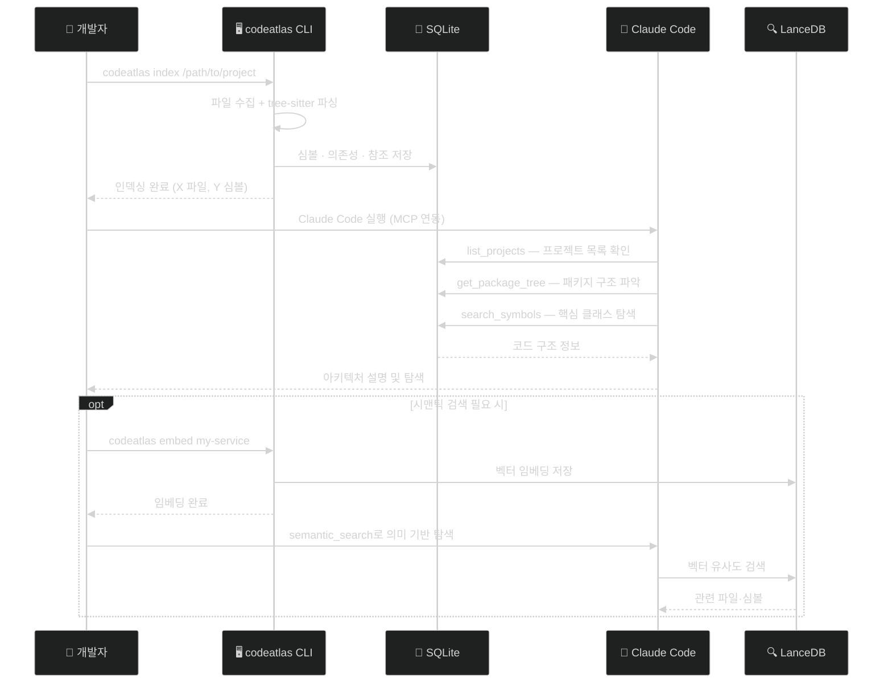

# CodeAtlas 단계별 가이드

모든 기능의 상세 사용법과 워크플로우를 설명합니다.

---

## 목차

1. [인덱싱](#1-인덱싱)
2. [검색](#2-검색)
3. [프로젝트 관리](#3-프로젝트-관리)
4. [데드 코드 검출](#4-데드-코드-검출)
5. [AI 요약](#5-ai-요약)
6. [시맨틱 검색](#6-시맨틱-검색)
7. [MCP 서버 운영](#7-mcp-서버-운영)
8. [설정 파일](#8-설정-파일)
9. [코드 편집 도구](#9-코드-편집-도구)
10. [프로젝트 메모리](#10-프로젝트-메모리)
11. [워크플로우 예시](#11-워크플로우-예시)

---

## 1. 인덱싱

### 기본 인덱싱

```bash
codeatlas index <project-path>
```

| 옵션 | 설명 | 기본값 |
|------|------|--------|
| `-n, --name <name>` | 프로젝트 이름 (미지정 시 디렉토리명 사용) | 디렉토리명 |
| `--incremental` | 변경된 파일만 재인덱싱 | false |
| `-v, --verbose` | 파일별 진행 상황 출력 | false |

### 증분 인덱싱

파일 변경 후 전체 재인덱싱 없이 변경분만 처리합니다.  
파일 내용의 SHA-256 해시를 비교하여 변경 여부를 판단합니다.

```bash
# 코드 변경 후
codeatlas index /path/to/project --incremental
```

```
Indexing my-app (/path/to/project) [incremental]...

Done in 89ms
  indexed : 3
  skipped : 84
  errors  : 0
```

### 다중 프로젝트 인덱싱

여러 프로젝트를 동시에 등록할 수 있습니다.

```bash
codeatlas index /projects/service-a --name service-a
codeatlas index /projects/service-b --name service-b
codeatlas index /projects/commons   --name commons
```

### 지원 언어

기본값으로 Java · JavaScript · TypeScript · Vue SFC 파일을 인덱싱합니다.  
`.codeatlas.yaml`으로 확장자 목록을 커스터마이징할 수 있습니다.

```yaml
# .codeatlas.yaml (프로젝트 루트에 배치)
indexer:
  extensions: [".java", ".js", ".ts", ".vue"]   # 기본값 교체 시
  skip_dirs: ["node_modules", "vendor", "dist"]
```

> Kotlin(`.kt`)은 파서 지원 준비 중이며 현재 심볼 추출은 비활성화 상태입니다.

### 인덱싱 제외 규칙

기본적으로 아래 디렉토리는 자동 제외됩니다:
- `node_modules`, `build`, `target`, `.gradle`
- `out` (프로젝트 루트 한정)
- `.`으로 시작하는 숨김 디렉토리

---

## 2. 검색

### FTS 키워드 검색

```bash
codeatlas search <query> [options]
```

| 옵션 | 설명 |
|------|------|
| `-k, --kind <kind>` | 심볼 종류 필터: `class`, `method`, `field`, `interface`, `enum` |
| `-l, --limit <n>` | 최대 결과 수 (기본: 20) |

```bash
# 이름으로 검색
codeatlas search UserService

# 특정 종류만
codeatlas search find --kind method --limit 50

# 복합 검색 (FTS5 prefix + LIKE fallback)
codeatlas search getUserById
```

### 검색 전략

CodeAtlas는 두 단계 검색 전략을 사용합니다:
1. **FTS5 prefix 매칭**: `UserService*` 형태로 빠른 전문 검색
2. **LIKE substring fallback**: FTS5 결과가 없을 때 `%getUserById%` 형태로 camelCase 검색

---

## 3. 프로젝트 관리

### 등록된 프로젝트 목록 확인

```bash
codeatlas list
```

```
[1] service-a
  path    : /projects/service-a
  indexed : 4/14/2026, 12:00:00 AM
[2] service-b
  path    : /projects/service-b
  indexed : 4/14/2026, 12:30:00 AM
```

### 인덱스 통계 확인

```bash
codeatlas stats
```

```
Index statistics:
  projects     : 2
  files        : 312
  symbols      : 4821
  dependencies : 1203
```

### 프로젝트 제거

```bash
# 목록에서 ID 확인 후 제거
codeatlas remove 1
```

> 제거 시 해당 프로젝트의 파일, 심볼, 참조, 요약 데이터가 모두 삭제됩니다.

---

## 4. 데드 코드 검출

### 기본 사용법

```bash
# 전체 프로젝트 스캔
codeatlas dead-code

# 특정 프로젝트만 (이름 또는 경로)
codeatlas dead-code my-app
codeatlas dead-code /path/to/project

# 특정 종류만
codeatlas dead-code my-app --kind method
codeatlas dead-code my-app --kind class
```

### 자동 제외 규칙

다음 심볼은 참조가 없더라도 데드 코드로 분류하지 않습니다:
- Spring 어노테이션: `@RestController`, `@Controller`, `@Service`, `@Component`, `@Repository`, `@Bean`, `@Configuration`
- Java 어노테이션: `@Override`
- 아키텍처 어노테이션: `@WebAdapter`, `@UseCase`, `@PersistenceAdapter`, `@ApiAdapter`
- 심볼 종류: `main()` 메서드, `public static final` 상수, 생성자, 열거형, 어노테이션 타입

심볼이 데드 코드로 판단되는 결정 흐름입니다:



### 설정 파일로 제외 규칙 추가

```yaml
# .codeatlas.yaml
dead_code:
  # 기본 12개 어노테이션에 추가
  exclude_annotations:
    - "@CustomEntry"
    - "@EventHandler"

  # 특정 파일 경로 제외 (glob 패턴)
  exclude_patterns:
    - "**/*Test.java"
    - "**/*Config.java"
    - "**/generated/**"
```

> `replace_annotations: true` 를 설정하면 기본 12개 어노테이션 대신 사용자 목록으로 완전 교체합니다.

---

## 5. AI 요약

### 기능 설명

`get_file_summary` MCP 도구 호출 시 파일에 대한 AI 요약을 **lazy 방식**으로 생성합니다:
- 최초 호출 → Anthropic API로 요약 생성 → DB 캐시 저장
- 이후 호출 → 캐시 반환 (API 호출 없음)
- 모델 버전이 변경되면 자동 재생성

### 요약 내용

- 파일의 책임과 역할 (2-4문장)
- 주요 디자인 패턴
- 소스 코드 앞 4000자를 기준으로 생성

### 모델 설정

```yaml
# .codeatlas.yaml
summaries:
  model: "claude-haiku-4-5-20251001"   # 빠르고 저렴한 모델로 교체 가능
```

기본값: `claude-sonnet-4-6`

### 환경 변수 설정

```bash
export ANTHROPIC_API_KEY=sk-ant-...
```

---

## 6. 시맨틱 검색

### 임베딩 생성

시맨틱 검색은 사전에 임베딩 벡터를 생성해야 합니다.

`codeatlas embed` 명령의 처리 흐름입니다:



```bash
codeatlas embed my-app

# 진행 상황 출력
codeatlas embed my-app --verbose
```

**최초 실행 시**: `Xenova/all-MiniLM-L6-v2` 모델 약 23MB 다운로드 (이후 캐시됨)

```
Embedding "my-app" (this may take a moment on first run — model download ~23MB)...

Done in 45213ms
  files   : 87
  symbols : 124
```

### 임베딩 대상

| 대상 | 내용 |
|------|------|
| 파일 | 경로 + 심볼 목록 + AI 요약 (있는 경우) 조합 |
| 심볼 | 클래스, 인터페이스, 열거형, 레코드, 어노테이션 타입 (최상위 선언만) |

> 메서드와 필드는 임베딩 대상에서 제외됩니다.

### MCP를 통한 시맨틱 검색

Claude에서:
```
> 결제 처리 로직을 담당하는 클래스를 찾아줘.
> 사용자 인증 관련 서비스 코드가 어디 있어?
```

벡터는 `~/.codeatlas/vectors/` 에 저장됩니다.

---

## 7. MCP 서버 운영

### MCP 서버 시작

```bash
# stdio 모드 (기본 — Claude Code 연동)
codeatlas serve

# HTTP 모드 (포트 지정 시)
codeatlas serve --port 3000
```

### Claude Code 연동

`~/.mcp.json`:

```json
{
  "mcpServers": {
    "codeatlas": {
      "command": "node",
      "args": ["/absolute/path/to/codeatlas/dist/cli/index.js", "serve"]
    }
  }
}
```

Claude Code 재시작 후 `/mcp` 명령으로 서버 상태 확인:

```
> /mcp
```

### 제공되는 MCP 도구 (24개)

**탐색 도구 (13개):**

| 도구 | 설명 |
|------|------|
| `list_projects` | 인덱싱된 프로젝트 목록 |
| `search_symbols` | 심볼 이름으로 검색 |
| `get_file_overview` | 파일 내 심볼 구조 트리 |
| `get_symbol_detail` | 심볼 상세 정보 (시그니처, 계층, 의존관계) |
| `get_dependencies` | 파일의 import/extends/implements 의존성 |
| `find_implementors` | 인터페이스 구현체 탐색 |
| `get_package_tree` | 패키지 계층 구조 트리 |
| `get_symbol_references` | 심볼 사용처 전체 조회 |
| `read_symbol_body` | 특정 심볼의 소스 코드 읽기 |
| `read_file_range` | 파일의 특정 라인 범위 읽기 |
| `find_dead_code` | 미참조(잠재적 데드) 심볼 탐색 |
| `get_file_summary` | AI 생성 파일 요약 (lazy 캐시) |
| `semantic_search` | 자연어 의미 기반 코드 검색 |

**분석 도구 (2개):**

| 도구 | 설명 |
|------|------|
| `get_impact_analysis` | 심볼 변경 시 영향받는 모든 호출자 탐색 (그래프 기반) |
| `find_circular_deps` | 상속/구현 순환 의존성 탐지 (그래프 기반) |

**편집 도구 (4개):**

| 도구 | 설명 |
|------|------|
| `replace_symbol_body` | 심볼 전체 본문 교체 |
| `insert_after_symbol` | 심볼 뒤에 코드 삽입 |
| `insert_before_symbol` | 심볼 앞에 코드 삽입 |
| `rename_symbol` | 심볼 이름 변경 (텍스트 기반) |

**메모리 도구 (5개):**

| 도구 | 설명 |
|------|------|
| `write_memory` | 프로젝트에 새 지식 메모리 작성 |
| `read_memory` | 저장된 메모리 읽기 |
| `list_memories` | 메모리 목록 조회 (태그 필터 가능) |
| `edit_memory` | 메모리 내용 수정 |
| `delete_memory` | 메모리 삭제 |

---

## 8. 설정 파일

### 파일 위치

인덱싱할 프로젝트 루트에 `.codeatlas.yaml` 파일을 배치합니다.

```
your-project/
  .codeatlas.yaml    ← 여기
  src/
  pom.xml
```

### 전체 스키마

```yaml
indexer:
  # 인덱싱할 파일 확장자 (기본값 교체)
  extensions: [".java", ".js", ".ts", ".vue", ".xml"]
  # 제외할 디렉토리 (기본값 교체)
  skip_dirs: ["node_modules", "build", "target", ".gradle", "vendor"]

dead_code:
  # 제외할 어노테이션 (기본 12개에 append)
  exclude_annotations:
    - "@CustomEntry"
  # true 시 기본 어노테이션 목록 완전 교체
  replace_annotations: false
  # 제외할 파일 경로 패턴 (picomatch glob)
  exclude_patterns:
    - "**/*Test.java"
    - "**/*Config.java"

summaries:
  # AI 요약에 사용할 Anthropic 모델
  model: "claude-sonnet-4-6"
```

> 자세한 내용은 [설정 파일 가이드](./architecture/configuration.md)를 참고하세요.

---

## 9. 코드 편집 도구

MCP 도구를 통해 Claude가 직접 소스 파일을 수정할 수 있습니다.

### 안전성 프로토콜

모든 편집 작업은 3단계 안전 프로토콜을 거칩니다:
1. **사전 검증**: tree-sitter로 심볼 위치 재파싱 → DB 기록과 불일치 시 거부
2. **원자적 쓰기**: `.tmp` 파일에 먼저 쓴 후 `rename()` 으로 교체 (충돌 방지)
3. **자동 재인덱싱**: 파일 수정 후 DB 자동 업데이트

### 도구별 사용법

**`replace_symbol_body`**: 메서드/클래스 전체 교체

```
> UserService의 findById 메서드를 Optional 반환형으로 리팩토링해줘.
```

**`insert_after_symbol`**: 메서드/클래스 뒤에 코드 삽입

```
> UserService 클래스 끝에 deleteById 메서드를 추가해줘.
```

**`rename_symbol`**: 텍스트 기반 이름 변경

```
> UserRepository를 UserJpaRepository로 이름을 변경해줘.
```

> **주의**: `rename_symbol`은 텍스트 기반 검색·교체입니다.  
> 리플렉션 또는 동적 디스패치로 사용되는 경우는 탐지하지 못합니다.

---

## 10. 프로젝트 메모리

프로젝트별 지식을 마크다운 파일로 저장하고 MCP 도구로 공유합니다.  
저장 경로: `<project-root>/.codeatlas/memories/<slug>.md`

### CLI 명령어

```bash
# 메모리 목록 확인
codeatlas memories list <project>

# 태그로 필터링
codeatlas memories list <project> --tag onboarding

# 메모리 내용 읽기
codeatlas memories read <project> <slug>

# 메모리 삭제
codeatlas memories delete <project> <slug>

# AI 온보딩 메모리 수동 생성 (ANTHROPIC_API_KEY 필요)
codeatlas memories onboard <project>
```

### 자동 온보딩

`codeatlas index` 완료 후 `.codeatlas/memories/`가 비어있고 `ANTHROPIC_API_KEY`가 설정되어 있으면 자동으로 4개의 메모리를 생성합니다:

| 슬러그 | 내용 |
|--------|------|
| `project-overview` | 언어·파일 수·심볼 통계·디렉토리 구조 |
| `architecture` | 아키텍처 패턴 (hexagonal, layered 등) |
| `entry-points` | 메인 클래스, REST 컨트롤러, 설정 파일 |
| `conventions` | 코딩 패턴, 네이밍 컨벤션, 빌드 도구 |

### MCP 도구로 메모리 활용

```
> list_memories로 이 프로젝트의 메모리 목록을 보여줘.
> read_memory로 architecture 메모리를 읽어줘.
> write_memory로 새로 알게 된 패턴을 기록해줘.
```

---

## 11. 워크플로우 예시

### 신규 프로젝트 온보딩

```bash
# 1. 인덱싱
codeatlas index /projects/my-service --name my-service --verbose

# 2. Claude Code에서 아키텍처 파악
# > list_projects로 프로젝트 확인
# > get_package_tree로 패키지 구조 파악
# > get_file_overview로 핵심 클래스 탐색

# 3. 임베딩 생성 (시맨틱 검색 필요 시)
codeatlas embed my-service
```

신규 프로젝트 온보딩의 전체 흐름입니다:



### 코드 리뷰 지원

```bash
# 변경된 파일만 재인덱싱
codeatlas index /projects/my-service --incremental

# Claude에서
# > 이번에 변경된 UserService의 의존성 분석
# > find_dead_code로 제거 가능한 메서드 확인
```

### 멀티 프로젝트 마이크로서비스 탐색

```bash
codeatlas index /projects/user-service     --name user-service
codeatlas index /projects/order-service    --name order-service
codeatlas index /projects/payment-service  --name payment-service

# Claude에서
# > 세 서비스에서 User 관련 클래스를 모두 찾아줘.
# > order-service에서 payment-service에 대한 의존성을 분석해줘.
```
