# CodeAtlas 퀵스타트

**5분 안에 Java · JS · TS · Vue 프로젝트를 AI가 탐색 가능한 코드 인덱스로 만드세요.**

```mermaid
%%{init: {'theme': 'dark', 'themeVariables': {'primaryColor': '#3b82f6', 'primaryTextColor': '#f8fafc', 'primaryBorderColor': '#60a5fa', 'lineColor': '#94a3b8', 'secondaryColor': '#1e293b', 'tertiaryColor': '#0f172a'}}}%%
flowchart LR
    S1["① 설치 & 빌드\nnpm install\nnpm run build"]:::cli
    S2["② 프로젝트 인덱싱\ncodeatlas index /path"]:::engine
    S3["③ CLI 검색 확인\ncodeatlas search ..."]:::cli
    S4["④ MCP 등록\n~/.mcp.json 수정"]:::mcp
    S5["⑤ Claude와 연동\nMCP 도구 호출"]:::mcp
    S6["⑥ 선택: 임베딩\ncodeatlas embed\n시맨틱 검색 활성화"]:::storage

    S1 --> S2 --> S3 --> S4 --> S5
    S5 -.->|"선택 사항"| S6

    classDef cli fill:#3b82f6,stroke:#60a5fa,color:#f8fafc
    classDef engine fill:#8b5cf6,stroke:#a78bfa,color:#f8fafc
    classDef mcp fill:#06b6d4,stroke:#22d3ee,color:#f8fafc
    classDef storage fill:#10b981,stroke:#34d399,color:#f8fafc
```



---

## 전제 조건

- Node.js 20 이상
- Java · JS · TS · Vue 프로젝트 1개 (인덱싱 대상)
- Claude Code (MCP 연동 사용 시)

---

## Step 1 — 설치 및 빌드

```bash
# 프로젝트 클론
git clone https://github.com/yeochul-jeon/code_atlas.git
cd codeatlas

# 의존성 설치
npm install

# TypeScript 컴파일
npm run build
```

전역 등록 (선택):

```bash
npm link
# 이후 어디서든 codeatlas 명령 사용 가능
```

---

## Step 2 — 프로젝트 인덱싱

```bash
# 기본 인덱싱 (Java · JS · TS · Vue 파일)
codeatlas index /path/to/your-project

# 이름 지정
codeatlas index /path/to/your-project --name my-app

# 진행 상황 출력
codeatlas index /path/to/your-project --verbose
```

성공 시 출력 예시:

```
Indexing my-app (/path/to/your-project)...

Done in 1234ms
  indexed : 87
  skipped : 0
  errors  : 0
```

인덱스는 `~/.codeatlas/index.db` 에 저장됩니다.

---

## Step 3 — 즉시 검색

```bash
# 심볼 이름으로 검색
codeatlas search UserService

# 메서드만 검색
codeatlas search findById --kind method

# 클래스만 검색
codeatlas search Repository --kind class
```

출력 예시:

```
[class] public UserService
  /path/to/your-project/src/main/java/com/example/UserService.java:12
[method] public User findById(Long id)
  /path/to/your-project/src/main/java/com/example/UserRepository.java:25
```

---

## Step 4 — Claude Code MCP 연동

`~/.mcp.json` 파일을 생성 (또는 기존에 항목 추가):

```json
{
  "mcpServers": {
    "codeatlas": {
      "command": "node",
      "args": ["/absolute/path/to/codeatlas/dist/cli/index.js", "serve"]
    }
  }
}
```

> `npm link` 를 했다면 `"command": "codeatlas", "args": ["serve"]` 로 단순화 가능

Claude Code를 재시작하면 **24개 코드 탐색·편집·메모리 도구**가 활성화됩니다.

---

## Step 5 — Claude에서 사용

Claude Code에서 자연어로 코드를 탐색하세요:

```
> UserService가 어떤 메서드를 제공하는지 알려줘.
> OrderController의 의존성을 분석해줘.
> 참조되지 않는 메서드를 찾아줘.
> UserRepository를 구현한 클래스가 뭐야?
```

---

## (선택) Step 6 — 시맨틱 검색 활성화

자연어 의미 기반 검색을 사용하려면 임베딩을 먼저 생성해야 합니다.  
모델 최초 다운로드 시 약 23MB 다운로드됩니다.

```bash
codeatlas embed my-app
```

완료 후 Claude에서:

```
> 결제 처리 관련 코드를 찾아줘. (semantic_search 도구 사용)
```

---

## 다음 단계

| 목표 | 문서 |
|------|------|
| 모든 CLI 명령 상세 사용법 | [단계별 가이드](./guide.md) |
| 설정 파일로 커스터마이징 | [설정 파일 가이드](./architecture/configuration.md) |
| 아키텍처 이해 | [아키텍처 개요](./architecture/overview.md) |
| MCP 도구 전체 목록 | [MCP 서버 & 도구](./architecture/mcp-server.md) |
